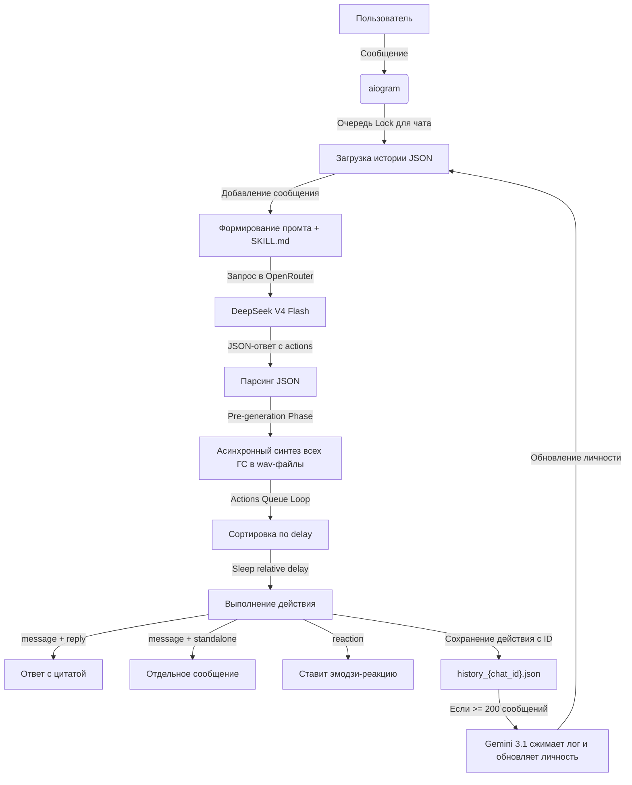

# MADI — Самообучающийся Telegram-бот с озвучкой и характером

**MADI** — это умный, самообучающийся Telegram-бот на базе `aiogram 3.x` и нейросетей OpenRouter, способный подстраиваться под стиль общения в группе, шутить, дерзить, использовать визуальные эффекты и озвучивать свои ответы клонированным голосом.

---

## Ключевые возможности

1. **🧠 Самообучение и сжатие контекста:**
   - Бот записывает историю чата вместе с реакциями пользователей на его ответы в JSON-файлы.
   - Каждые 200 сообщений запускается модель сжатия контекста (`google/gemini-3.1-flash-lite`), которая анализирует диалог: какие шутки зашли (собрали лайки `👍`/огоньки `🔥`), где бот сглупил (собрал клоунов `🤡`/дизлайки `👎`), когда стоило промолчать.
   - На основе этого обновляется профиль личности бота (`personality_summary`), влияющий на все его последующие ответы.
   
2. **🎙️ Продвинутый Text-to-Speech (TTS):**
   - **XTTS-v2:** Клонирование голоса по короткой аудиозаписи (референсу).
   - **Silero:** Сверхбыстрые встроенные голоса (`aidar`, `baya`, `kseniya` и др.).
   - Все тяжелые нейросетевые модели выполняются в фоновых потоках (`asyncio.to_thread`), бот остается отзывчивым и не виснет во время генерации.
   - **Установка голоса прямо из чата:** отправьте боту ГС или аудиофайл с подписью `/setvoice`, и бот клонирует этот голос для последующих сообщений. Для переключения на Silero используйте `/setvoice_silero <имя_голоса>`.

3. **⏱️ Точная очередь действий (Actions Queue) и задержки:**
   - Бот может планировать несколько действий на одно входящее сообщение (например, поставить реакцию через 1 секунду и написать ответ через 4 секунды).
   - Все голосовые сообщения **генерируются предварительно (upfront)**, благодаря чему время генерации аудио не сбивает задержки отправки в Telegram. Паузы между сообщениями отрабатывают с точностью до доли секунды.

4. **💬 Различные режимы ответов (`reply_mode`):**
   - Отправка в режиме `reply` (ответ с цитированием конкретного сообщения в Telegram).
   - Отправка в режиме `standalone` (новое сообщение в чат без цитирования).
   - Цитирование **любых прошлых сообщений из истории** по их числовому ID (передается через параметр `reply_to_message_id`).

5. **✨ Эффекты сообщений в Telegram:**
   - Поддержка наложения визуальных эффектов сообщений (`fire`, `poop`, `heart`, `thumbs_up`, `thumbs_down`, `celebration`). Эффект накладывается на первое отправленное в серии сообщение.

---

## Требования к установке

- Python 3.10+
- ОС: Windows / Linux / macOS
- Установленные библиотеки (устанавливаются автоматически через `run.bat`):
  - `aiogram`
  - `aiohttp`
  - `soundfile`
  - Для работы XTTS/Silero: `torch`, `torchaudio`, `numpy`, `TTS`.
  
> [!NOTE]
> На Windows используется обходной путь (monkey-patch) для `torchaudio.load` с применением python-пакета `soundfile`. Вам **не нужно** устанавливать системные C++ библиотеки FFmpeg или компилировать зависимости, все работает "из коробки" на CPU.

---

## Быстрый запуск

1. Склонируйте репозиторий:
   ```bash
   git clone https://github.com/Me1l0n/MADI.git
   cd MADI
   ```
2. Создайте файл **`.env`** в корневой директории бота и заполните его:
   ```env
   TELEGRAM_BOT_TOKEN=ваш_токен_бота_от_botfather
   OPENROUTER_API_KEY=ваш_api_ключ_openrouter
   
   # Выбор моделей
   MAIN_MODEL=deepseek/deepseek-v4-flash
   COMPRESSION_MODEL=google/gemini-3.1-flash-lite
   
   # Настройки TTS озвучки
   TTS_ENABLED=true
   TTS_PROVIDER=xtts
   TTS_VOICE=xtts_v2/1.wav
   TTS_VOICE_PROBABILITY=0.2
   ```
3. Разместите файл инструкций очеловечивания текста **`SKILL.md`** в корневом каталоге бота (он содержит правила построения ответов, сленг, маты и характер бота).
4. Запустите файл **`run.bat`** (двойным кликом в Windows) или выполните команду:
   ```bash
   python main.py
   ```
5. **Важно:** Перейдите в `@BotFather` -> **Bot Settings** -> **Group Privacy** -> нажмите **Turn off** (Disable), чтобы бот в группах мог видеть все сообщения, а не только прямые упоминания своего имени.

---

## Архитектура работы


